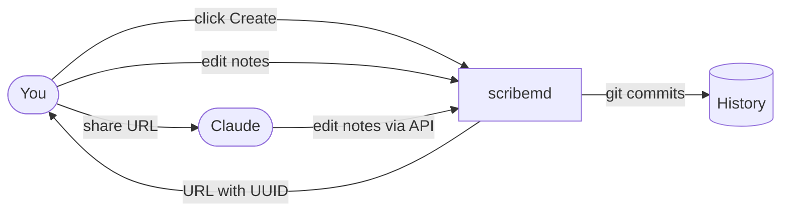
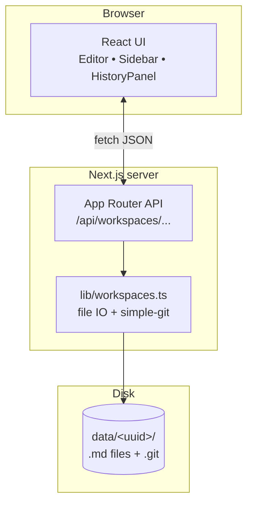

# scribemd

> Permissionless markdown workspaces. Click "Create" → get a sharable URL →
> write together with Claude (or any human) from anywhere.

scribemd is a local-first, self-hosted markdown editor where each workspace
is identified by an unguessable UUID. Anyone who knows the URL can read,
write, rename, delete, and commit `.md` files in it — no login, no signup.
The URL itself is the access credential.

Every workspace is its own git repository under the hood, so every change
can be snapshotted with a commit message and recovered from history later.

[](LICENSE)
[](https://nextjs.org)
[](https://www.typescriptlang.org)
[](public/llms.txt)

## Why

Most collaborative editors force a login, a workspace, a tenant, and a
permission graph before you can write a single word. That model fights the
shape of how AI agents and quick collaborators actually want to work:
*"here's a URL — go edit"*.

scribemd inverts it. A workspace is a capability link. Hand it to Claude in
a conversation, paste it into a Slack thread, share it with a friend. They
load the URL and start editing. When you want history, you commit. When you
want to revoke access, you stop sharing the URL (and, in a future version,
rotate it).

## How it works



1. Click **Create new workspace** on the landing page.
2. You're redirected to `/w/<uuid>`. Copy the URL.
3. Share it. Anyone with it sees the same editor. Edit, save, commit, share
   the link with more people. Browse history when you need to undo.

## Quickstart

Requires Node 20+ and git.

```bash
git clone https://github.com/Pawel-608/scribemd.git
cd scribemd
npm install
npm run dev
```

Open <http://localhost:3000>. Click **Create new workspace**.

For an always-on local install (macOS LaunchAgent), see
[Deployment](#deployment).

## Features

- **Permissionless workspaces** — every workspace is a v4 UUID; sharing the
  URL is the entire access model.
- **Live markdown preview** — split editor + preview with GitHub-flavored
  markdown.
- **Mermaid diagrams** — fenced ` ```mermaid ` blocks render as SVG in the
  preview pane.
- **File explorer with folders** — paths containing `/` show as collapsible
  folders, like an S3 console.
- **Per-workspace git history** — every workspace is a git repo; explicit
  commits with messages; browse the timeline; view any file at any commit;
  restore historical versions in one click.
- **Rename, move, delete** — first-class operations from the UI and API.
- **JSON API for everything** — every UI action has a matching REST
  endpoint. See [`public/llms.txt`](public/llms.txt) for the full reference,
  written so Claude (or any agent) can drive scribemd directly.
- **No auth, no telemetry, no database** — workspaces are plain directories
  under `./data/<uuid>/`.

## Architecture



Everything Next.js — no extra services, no separate backend, no database.
A workspace is a directory; history lives in its `.git`. Move the `data/`
folder and you've moved every workspace.

## API

All endpoints return JSON. The URL of a workspace is the only credential.

| Method | Path | Purpose |
|--------|------|---------|
| POST   | `/api/workspaces`                                | Create a new workspace |
| GET    | `/api/workspaces/:id/files`                      | List `.md` files |
| GET    | `/api/workspaces/:id/files/:path[?at=<sha>]`     | Read current or historical version |
| PUT    | `/api/workspaces/:id/files/:path`                | Create or overwrite |
| DELETE | `/api/workspaces/:id/files/:path`                | Delete |
| POST   | `/api/workspaces/:id/rename` `{from, to}`        | Move / rename |
| GET    | `/api/workspaces/:id/status`                     | Uncommitted change count |
| POST   | `/api/workspaces/:id/commit` `{message}`         | Snapshot changes |
| GET    | `/api/workspaces/:id/history`                    | List commits |
| GET    | `/api/workspaces/:id/history/:sha`               | Files changed in a commit |

For AI agents, [`public/llms.txt`](public/llms.txt) is also served at
`http://<host>/llms.txt`.

### Example

```bash
HOST="http://localhost:3000"

# Create a workspace
ID=$(curl -s -X POST "$HOST/api/workspaces" | jq -r .id)
echo "https://$HOST/w/$ID"

# Write a note
curl -s -X PUT "$HOST/api/workspaces/$ID/files/notes/today.md" \
  -H 'content-type: application/json' \
  -d '{"content":"# Today\n\n- Ship scribemd README"}'

# Commit
curl -s -X POST "$HOST/api/workspaces/$ID/commit" \
  -H 'content-type: application/json' \
  -d '{"message":"Daily note"}'

# Browse history
curl -s "$HOST/api/workspaces/$ID/history" | jq
```

## Project layout

```
app/
  api/workspaces/             REST routes (files, rename, commit, status, history)
  components/                 React UI (Editor, Sidebar, HistoryPanel, …)
  lib/api.ts                  Typed client used by the UI
  w/[id]/page.tsx             Workspace editor page
  page.tsx                    Landing page
lib/
  workspaces.ts               File IO + simple-git wrapper
public/
  llms.txt                    API guide for AI agents
data/                         Workspace storage (gitignored)
```

## Stack

- [Next.js 15](https://nextjs.org) (App Router) + [React 19](https://react.dev)
- [TypeScript](https://www.typescriptlang.org) end-to-end
- [Tailwind CSS](https://tailwindcss.com)
- [`react-markdown`](https://github.com/remarkjs/react-markdown) +
  [`remark-gfm`](https://github.com/remarkjs/remark-gfm) for preview
- [`mermaid`](https://mermaid.js.org) for diagrams (dynamically imported)
- [`simple-git`](https://github.com/steveukx/git-js) for per-workspace history

## Deployment

### Local always-on (macOS)

The repo includes a LaunchAgent recipe so scribemd runs as a background
service on your Mac:

```bash
# After cloning and running `npm install` && `npm run build`:
cp deploy/com.scribemd.dev.plist ~/Library/LaunchAgents/
launchctl bootstrap gui/$(id -u) ~/Library/LaunchAgents/com.scribemd.dev.plist

# Control:
launchctl list | grep scribemd
launchctl kickstart -k gui/$(id -u)/com.scribemd.dev   # restart
launchctl bootout   gui/$(id -u)/com.scribemd.dev      # stop
```

Logs land in `~/Library/Logs/scribemd.{log,err.log}`.

> **Note:** edit the plist's `WorkingDirectory` and the absolute paths to
> `node` (nvm-managed installs vary) before loading.

### Anywhere else

`npm run build && npm run start` produces a normal Node.js server. Set
`SCRIBEMD_DATA_DIR` to control where workspaces live, `PORT` for the port.
Front it with a reverse proxy if you expose it to the internet — there is
**no** built-in auth, rate limiting, or TLS.

## Caveats

scribemd is intentionally small. Things it does **not** do:

- No authentication. The UUID *is* the credential. Anyone with the URL has
  full read/write/delete/commit access.
- No conflict resolution. Last writer wins.
- No automatic compaction or backup of workspace history.
- No realtime collaboration (yet) — refresh / Pull-equivalents are explicit
  via the API.

If those constraints don't fit your use case, you probably want HackMD,
Notion, or Obsidian Sync. If they do — and you want an editor an LLM can
drive without OAuth gymnastics — scribemd might be perfect.

## Contributing

Issues and PRs are welcome. The codebase is small and deliberately
unstructured (no test framework yet, no design system, no monorepo
tooling); the goal is to keep it readable and easy to fork.

If you're building something on top of the API, the
[`llms.txt`](public/llms.txt) reference is the canonical contract.

## License

[MIT](LICENSE).
